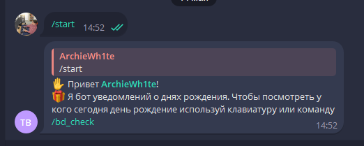
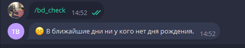
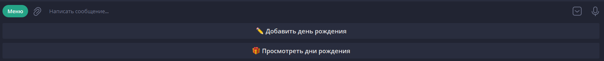
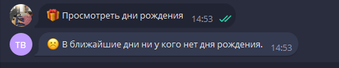
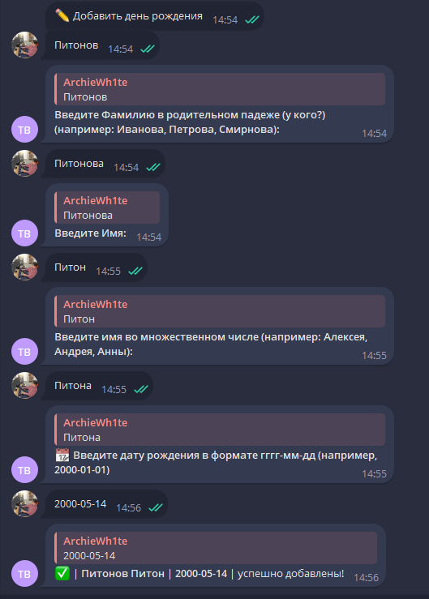
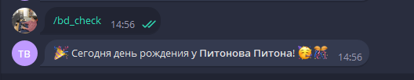
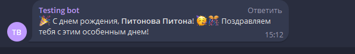

**Бот напоминалка о днях рождения**

**Author:** [@ArchieWh1te](https://t.me/archiewh1te)

**Language:** Python 3.10

**СУБД:** SQLite 

**framework for Telegram** Aiogram 3.3.0

[](https://pypi.org/project/aiogram/3.3.0/)


 


**Бот напоминает у кого ближайшее день рождения.**

Бот отправляет у кого ближайшее день рождения в группу телеграмма по времени в 9:05 утра(редактируется в `app.py`),
а так же можно отдельно посмотреть в боте с помощью команды `/bd_check` и кнопки.
Добавить пользователя и дату рождения можно с помощью команды `/add_bd` и кнопки.


**Для работы вам потребуется:**

1. Создать виртуальное окружение `python -m venv venv`
2. Активировать в **Windows**: `venv\Scripts\activate` или в **Linux**: `source myenv/bin/activate`
3. установить все зависимости из `pip install -r requirements.txt`
4. Отредактировать файл **.env** там указываете конфигурацию для подключения к **СУБД** и токкен для бота, айди админа, айди группы из телеграмма.

```
BOT_TOKEN=тутваштоккен

ADMINS=айди из тг

DB_FILE=birthdays.db

DEV_ID=айди из тг

CHAT=айди чата
```
**Запуск бота**

Для запуска бота используйте файл ```app.py```

**Обзор**







